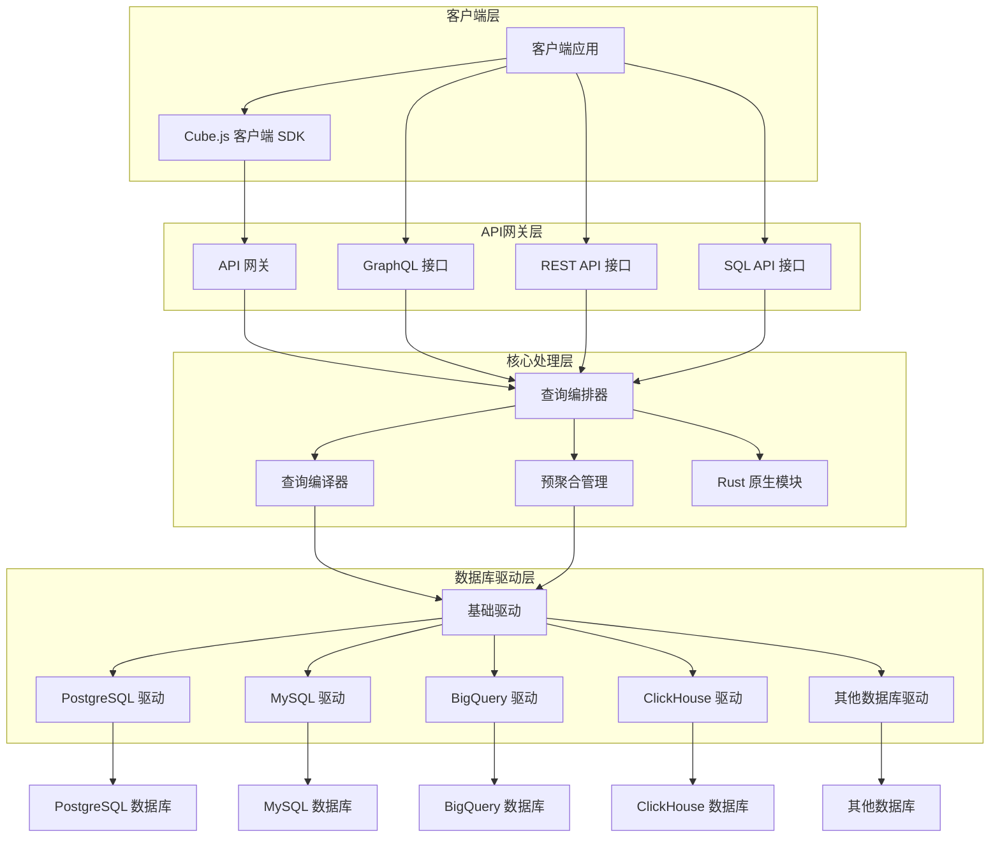

# Cube.js 项目分析报告

## 1. 仓库概览

### 1.1 项目名称
Cube.js

### 1.2 功能描述
Cube.js 是一个强大的开源数据查询和分析平台，专为构建分析型应用程序而设计。它提供了一套完整的工具链，包括：

- 统一的 API 接口（REST 和 GraphQL）用于数据查询
- 多种数据库的驱动支持（PostgreSQL、MySQL、BigQuery、ClickHouse 等）
- 智能预聚合功能，提高查询性能
- 灵活的认证和授权机制
- SQL 接口，允许直接执行 SQL 查询
- 命令行工具，简化项目创建和管理

### 1.3 技术栈

| 类别 | 技术/框架 | 用途 |
|------|-----------|------|
| 主要语言 | TypeScript, JavaScript | 核心逻辑实现 |
| 性能优化 | Rust | 原生模块，提高数据处理性能 |
| Web 框架 | Express.js | API 网关和 HTTP 服务 |
| 数据查询 | GraphQL | 提供 GraphQL 查询接口 |
| 构建工具 | Rollup, Lerna | 模块打包和 monorepo 管理 |
| 认证 | JWT | 安全认证机制 |
| 数据库 | 多种驱动 | 支持各类数据库系统 |

### 1.4 核心领域

- **数据查询处理**：处理和执行各类数据查询请求
- **预聚合管理**：创建和管理预聚合以提高性能
- **元数据管理**：处理数据模型的元数据
- **多数据库适配**：通过驱动机制支持多种数据库
- **API 网关**：提供统一的 API 接口和认证

## 2. 整体架构概述

### 2.1 主要模块

1. **API 网关层** (`cubejs-api-gateway`)
   - 处理 HTTP 请求和响应
   - 提供 REST 和 GraphQL 接口
   - 管理认证和授权
   - 请求路由和处理

2. **核心处理层**
   - `cubejs-backend-native`：Rust 编写的原生模块，处理高性能数据操作
   - `cubejs-backend-shared`：共享的后端工具和功能

3. **数据库驱动层**
   - 多种数据库驱动（如 `cubejs-athena-driver`、`cubejs-bigquery-driver` 等）
   - 提供统一的数据库访问接口

4. **CLI 工具** (`cubejs-cli`)
   - 项目创建和管理
   - 代码生成和验证

5. **客户端库** (`cubejs-client-core`)
   - 提供客户端 API 访问

### 2.2 服务间关系

- **API 网关** 作为前端接口，接收客户端请求并路由到相应的处理模块
- **核心处理层** 处理业务逻辑，包括查询解析、优化和执行
- **数据库驱动层** 负责与具体数据库的通信
- **CLI 工具** 用于项目初始化和管理，与其他模块是独立的

### 2.3 技术选型

- **TypeScript**：提供类型安全，减少运行时错误
- **Rust**：用于性能关键部分，提高处理速度
- **Express.js**：成熟的 Web 框架，适合构建 API 服务
- **GraphQL**：提供灵活的查询接口
- **Lerna**：管理 monorepo 结构，便于模块间协作

## 3. 模块化架构图



## 4. 核心代码模块

### 4.1 API 网关模块 (`cubejs-api-gateway`)

**核心文件**：`src/gateway.ts`

- **功能**：处理 HTTP 请求，提供 REST 和 GraphQL 接口，管理认证和授权
- **关键组件**：
  - `ApiGateway` 类：核心网关实现
  - 路由处理：为不同类型的请求提供路由
  - 认证中间件：处理用户认证
  - 查询处理：处理数据查询请求

**主要接口**：
- `/cubejs-api/v1/load`：执行数据查询
- `/cubejs-api/v1/sql`：执行 SQL 查询
- `/cubejs-api/v1/meta`：获取元数据
- `/cubejs-api/graphql`：GraphQL 接口

### 4.2 原生模块 (`cubejs-backend-native`)

**核心文件**：`src/lib.rs`

- **功能**：提供高性能的数据处理能力，使用 Rust 实现
- **关键组件**：
  - 查询执行引擎
  - 数据处理和转换
  - 与 JavaScript 的绑定

### 4.3 CLI 工具 (`cubejs-cli`)

**核心文件**：`src/cli.ts`

- **功能**：项目创建和管理，代码生成
- **关键命令**：
  - `cubejs create`：创建新项目
  - `cubejs generate`：生成代码
  - `cubejs deploy`：部署项目

### 4.4 数据库驱动

**基础驱动**：`cubejs-base-driver`
- **功能**：定义驱动接口，提供通用功能

**具体驱动**：如 `cubejs-postgres-driver`、`cubejs-bigquery-driver` 等
- **功能**：实现特定数据库的访问逻辑

### 4.5 客户端核心 (`cubejs-client-core`)

**核心文件**：`src/index.ts`

- **功能**：提供客户端 API 访问能力
- **关键组件**：
  - HTTP 传输层
  - 查询构建器
  - 结果处理

## 5. 代码质量和潜在问题

### 5.1 代码质量

- **优点**：
  - 模块化设计，代码组织清晰
  - 使用 TypeScript 提供类型安全
  - 完善的测试覆盖
  - 良好的错误处理机制
  - 详细的文档

- **潜在问题**：
  1. **复杂性**：项目结构复杂，模块间依赖较多，可能增加维护难度
  2. **性能瓶颈**：在处理大量数据时，某些操作可能成为瓶颈
  3. **安全隐患**：
     - 认证机制可能存在漏洞
     - SQL 注入风险（尽管有参数化查询）
  4. **依赖管理**：
     - 大量依赖包，可能存在版本冲突
     - 部分依赖可能过时
  5. **错误处理**：
     - 某些错误处理逻辑可能不够完善
     - 错误信息可能不够清晰

### 5.2 设计缺陷

- **模块化过度**：某些功能被拆分到多个模块，增加了理解和维护难度
- **配置复杂性**：配置选项过多，可能导致配置错误
- **缺少统一的错误处理策略**：不同模块的错误处理方式不一致
- **文档与代码不同步**：部分文档可能过时或与代码不符

## 6. 改进建议

### 6.1 性能优化

- **预聚合优化**：
  - 改进预聚合的自动创建和管理机制
  - 优化预聚合的存储和检索策略
- **查询执行优化**：
  - 进一步利用 Rust 原生模块提高性能
  - 实现更智能的查询缓存机制
- **并行处理**：
  - 增加并行查询处理能力
  - 优化并发控制机制

### 6.2 安全性增强

- **认证和授权**：
  - 实现更强大的认证机制
  - 提供更细粒度的授权控制
- **输入验证**：
  - 加强所有输入的验证
  - 防止 SQL 注入和其他注入攻击
- **安全审计**：
  - 增加安全审计日志
  - 定期进行安全扫描

### 6.3 可维护性改进

- **代码重构**：
  - 简化模块间的依赖关系
  - 减少代码重复
- **文档改进**：
  - 保持文档与代码同步
  - 增加更详细的架构文档
- **测试增强**：
  - 增加更多的集成测试
  - 改进测试覆盖率

## 7. 部署指南

### 7.1 部署方式

Cube.js 支持多种部署方式：

1. **Docker 部署**（推荐）
   - 使用官方 Docker 镜像
   - 简化依赖管理和环境配置

2. **Node.js 部署**
   - 直接在 Node.js 环境中部署
   - 需要手动安装依赖

3. **Serverless 部署**
   - 支持 AWS Lambda、Google Cloud Functions 等
   - 适合按需使用的场景

### 7.2 部署步骤

以 Docker 部署为例：

1. **准备配置文件**：
   - 创建 `.env` 文件，配置 API 密钥和数据库连接

2. **创建 Dockerfile**：
   ```dockerfile
   FROM cubejs/cube:latest
   COPY .env .env
   COPY schema ./schema
   ```

3. **构建和运行容器**：
   ```bash
   docker build -t cubejs-app .
   docker run -p 4000:4000 cubejs-app
   ```

4. **验证部署**：
   - 访问 `http://localhost:4000` 检查服务状态

### 7.3 注意事项

- **环境变量**：确保正确配置所有必要的环境变量
- **数据库连接**：确保数据库连接字符串正确且数据库可访问
- **API 密钥**：使用强随机密钥，并妥善保管
- **预聚合存储**：配置适当的预聚合存储策略
- **资源分配**：根据数据量和查询负载分配足够的资源
- **监控**：设置适当的监控以检测性能问题

## 8. 总结

### 8.1 核心价值

Cube.js 是一个功能强大、设计灵活的数据查询和分析平台，其核心价值在于：

- **统一的查询接口**：提供 REST、GraphQL 和 SQL 接口，满足不同场景的需求
- **多数据库支持**：通过驱动机制支持多种数据库，提高了平台的通用性
- **性能优化**：通过预聚合和 Rust 原生模块提高查询性能
- **灵活性**：支持多种部署方式和配置选项
- **生态系统**：丰富的插件和集成，便于扩展功能

### 8.2 挑战

Cube.js 面临的主要挑战包括：

- **复杂性管理**：随着功能的增加，代码和配置复杂性也在增加
- **性能优化**：处理大规模数据时的性能挑战
- **安全性**：确保数据查询和 API 访问的安全性
- **可维护性**：保持代码库的可维护性和文档的同步
- **扩展性**：支持不断增长的数据源和查询需求

### 8.3 未来展望

Cube.js 作为一个开源项目，具有良好的发展前景：

- 可以进一步扩展对新型数据库和数据存储的支持
- 可以增强实时数据分析能力
- 可以提供更丰富的可视化和集成选项
- 可以进一步优化性能和降低资源消耗

通过持续的改进和社区贡献，Cube.js 有望成为数据查询和分析领域的标准解决方案之一。

## 9. 参考资料

- [Cube.js 官方文档](https://cube.dev/docs)
- [Cube.js GitHub 仓库](https://github.com/cube-js/cube)
- [Cube.js 架构设计](https://cube.dev/blog/architecture-of-cubejs)
- [Cube.js 性能优化指南](https://cube.dev/blog/cubejs-performance-optimization)