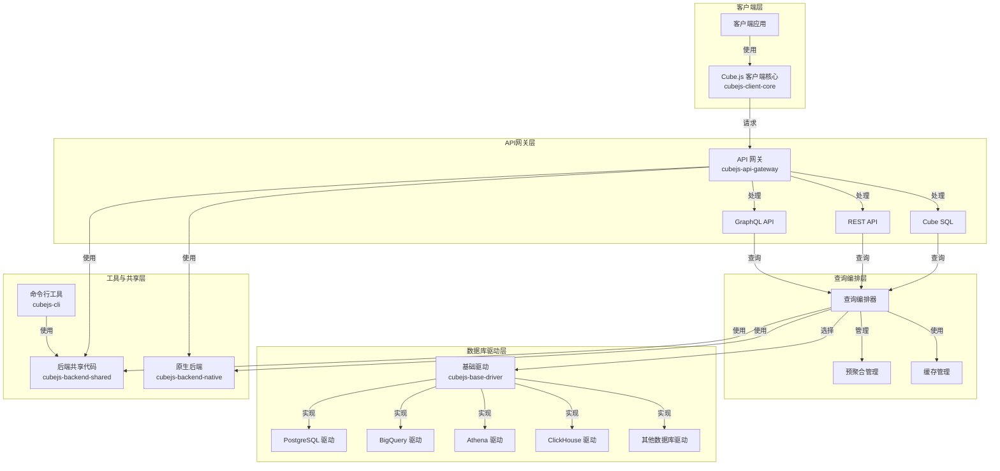

# Cube.js 项目分析报告

## 1. 仓库概览

### 项目名称
Cube.js

### 功能
Cube.js 是一个开源的分析型应用框架，专为构建数据密集型应用而设计。它提供了以下核心功能：
- 数据建模与抽象
- 多数据源支持（如 PostgreSQL、BigQuery、Athena 等）
- SQL 查询生成与优化
- 预聚合（Pre-Aggregations）支持，提升查询性能
- 缓存机制
- REST API 和 GraphQL API 接口
- Cube SQL 支持，允许使用标准 SQL 查询数据
- 安全认证与授权

### 技术栈
- **前端**：TypeScript
- **后端**：Node.js, TypeScript, Rust (部分核心功能)
- **构建工具**：Rollup, TypeScript
- **包管理**：Yarn, Lerna (monorepo)
- **Web 框架**：Express
- **API**：REST, GraphQL
- **认证**：JWT
- **数据库驱动**：多种数据库专用驱动

### 核心领域
- 数据建模与抽象
- 查询编排与优化
- 性能优化（预聚合、缓存）
- 多数据源集成
- API 网关与安全

## 2. 整体架构概述

### 主要模块
1. **API 网关层**：由 `cubejs-api-gateway` 负责，处理所有客户端请求，包括 REST API、GraphQL API 和 Cube SQL 请求。
2. **查询编排层**：负责解析、优化和执行查询。
3. **数据库驱动层**：由多个数据库专用驱动组成，如 `cubejs-athena-driver`、`cubejs-bigquery-driver` 等，负责与不同类型的数据库通信。
4. **客户端层**：由 `cubejs-client-core` 提供，为前端应用提供与后端通信的能力。
5. **命令行工具**：由 `cubejs-cli` 提供，用于创建和管理 Cube.js 项目。
6. **后端共享**：由 `cubejs-backend-shared` 提供，包含各后端模块共享的代码。
7. **原生后端**：由 `cubejs-backend-native` 提供，使用 Rust 实现部分核心功能，提升性能。

### 服务间关系
- 客户端通过 `cubejs-client-core` 与 API 网关通信
- API 网关接收请求后，通过查询编排层处理查询
- 查询编排层根据数据源类型，选择相应的数据库驱动执行查询
- 数据库驱动负责与实际数据库通信，执行 SQL 查询并返回结果
- 结果经过处理后，通过 API 网关返回给客户端

### 技术选型
- **TypeScript**：提供类型安全，减少运行时错误
- **Node.js**：作为主要运行环境，提供异步 I/O 能力
- **Rust**：用于性能关键部分，如查询执行和数据处理
- **Express**：作为 Web 框架，处理 HTTP 请求
- **GraphQL**：提供灵活的 API 查询能力
- **Lerna**：管理 monorepo 结构，简化多包管理

## 3. 模块化架构图



## 4. 核心代码模块

### 4.1 API 网关 (`cubejs-api-gateway`)

API 网关是 Cube.js 的核心入口点，负责处理所有客户端请求。它提供了以下功能：
- 处理 REST API 请求（如 `/v1/load`、`/v1/sql` 等）
- 处理 GraphQL API 请求
- 处理 Cube SQL 请求
- 认证与授权
- 请求解析与验证
- 响应格式化

核心文件：
- `src/gateway.ts`：定义了 `ApiGateway` 类，是 API 网关的核心实现
- `src/graphql.ts`：处理 GraphQL 请求
- `src/sql-server.ts`：处理 Cube SQL 请求
- `src/request-parser.ts`：解析请求参数

### 4.2 客户端核心 (`cubejs-client-core`)

客户端核心库提供了与 Cube.js 后端通信的能力，主要功能包括：
- 发送查询请求
- 处理查询结果
- 支持订阅模式（实时数据更新）
- 提供 SQL 生成功能
- 元数据获取

核心文件：
- `src/index.ts`：定义了 `CubeApi` 类，是客户端的主要入口点
- `src/HttpTransport.ts`：处理 HTTP 通信
- `src/SqlQuery.ts`：处理 SQL 查询相关功能
- `src/ResultSet.ts`：处理查询结果

### 4.3 数据库驱动 (`cubejs-base-driver` 及其他驱动)

数据库驱动负责与不同类型的数据库通信，执行 SQL 查询并返回结果。`cubejs-base-driver` 提供了基础驱动接口，各具体驱动实现了针对特定数据库的功能。

核心文件：
- `src/index.ts`：定义了基础驱动接口
- 各具体驱动的实现文件（如 `cubejs-athena-driver/src/AthenaDriver.ts`）

### 4.4 命令行工具 (`cubejs-cli`)

命令行工具用于创建和管理 Cube.js 项目，提供了以下功能：
- 创建新的 Cube.js 项目
- 部署项目
- 生成令牌
- 验证配置

核心文件：
- `src/cli.ts`：命令行工具的主入口
- `src/command/create.ts`：创建新项目的命令
- `src/command/deploy.ts`：部署项目的命令
- `src/command/server.ts`：启动服务器的命令

### 4.5 后端共享代码 (`cubejs-backend-shared`)

后端共享代码包含了各后端模块共享的功能，如：
- 环境变量处理
- 工具函数
- 类型定义
- 错误处理

核心文件：
- `src/env.ts`：环境变量处理
- `src/helpers.ts`：工具函数
- `src/errors.ts`：错误处理

### 4.6 原生后端 (`cubejs-backend-native`)

原生后端使用 Rust 实现了部分核心功能，以提升性能，主要包括：
- 查询执行
- 数据处理
- 预聚合管理

核心文件：
- `src/lib.rs`：Rust 代码的主入口
- `src/gateway/mod.rs`：与 API 网关的集成

## 5. 代码质量和潜在问题

### 代码质量
- **类型安全**：使用 TypeScript 提供了良好的类型安全
- **模块化设计**：采用模块化设计，各组件职责清晰
- **代码组织**：使用 monorepo 结构管理多个包，便于维护
- **测试覆盖**：大部分模块都有相应的测试代码

### 潜在问题

#### 设计缺陷
1. **复杂性较高**：项目结构复杂，模块间依赖关系较多，对新开发者不够友好
2. **配置分散**：配置项较多且分散在不同文件中，增加了配置难度
3. **错误处理**：部分错误处理逻辑不够统一，可能导致错误信息不一致

#### 性能瓶颈
1. **预聚合管理**：预聚合的构建和管理可能成为性能瓶颈，特别是在处理大量数据时
2. **缓存策略**：缓存策略可能需要根据具体使用场景进行优化
3. **网络延迟**：客户端与服务器之间的网络延迟可能影响用户体验，特别是在处理复杂查询时

#### 安全隐患
1. **认证与授权**：虽然提供了认证机制，但需要正确配置才能确保安全
2. **SQL 注入**：虽然使用了参数化查询，但在处理用户输入时仍需谨慎
3. **敏感信息泄露**：错误信息可能包含敏感信息，需要适当处理

## 6. 改进建议

### 1. 简化配置与部署流程

**问题**：当前配置项较多且分散，部署流程相对复杂。

**建议**：
- 提供更简洁的配置文件格式，减少配置项数量
- 开发更直观的部署工具，支持一键部署
- 提供详细的配置示例和最佳实践指南
- 考虑使用容器化技术（如 Docker）简化部署

### 2. 提升性能与可扩展性

**问题**：在处理大量数据时，性能可能成为瓶颈。

**建议**：
- 进一步优化预聚合策略，支持更智能的预聚合选择
- 增强缓存机制，支持更多缓存后端（如 Redis 集群）
- 改进查询优化器，生成更高效的 SQL 查询
- 考虑支持水平扩展，通过多实例部署提升处理能力

### 3. 增强开发者体验

**问题**：项目结构复杂，对新开发者不够友好。

**建议**：
- 提供更详细的开发者文档，包括架构设计、模块职责等
- 开发交互式的开发工具，简化数据建模和查询测试
- 增强错误提示，提供更清晰的错误信息和解决方案建议
- 建立更完善的示例库，覆盖常见使用场景

## 7. 部署

### 部署方式

Cube.js 可以通过多种方式部署，包括：

1. **本地部署**：使用 `cubejs-cli` 启动本地服务器
2. **容器部署**：使用 Docker 容器部署
3. **云服务部署**：部署到各种云服务提供商，如 AWS、GCP、Azure 等
4. **Serverless 部署**：部署到 Serverless 环境，如 AWS Lambda

### 部署步骤

#### 本地部署

1. **安装 Cube.js CLI**：
   ```bash
   npm install -g cubejs-cli
   ```

2. **创建项目**：
   ```bash
   cubejs create hello-world -d postgres
   ```

3. **配置数据源**：编辑 `.env` 文件，配置数据库连接信息

4. **启动服务器**：
   ```bash
   npm run dev
   ```

#### Docker 部署

1. **创建 Dockerfile**：
   ```dockerfile
   FROM node:14
   WORKDIR /app
   COPY package*.json ./
   RUN npm install
   COPY . .
   EXPOSE 4000
   CMD ["npm", "run", "start"]
   ```

2. **构建镜像**：
   ```bash
   docker build -t cubejs-app .
   ```

3. **运行容器**：
   ```bash
   docker run -p 4000:4000 --env-file .env cubejs-app
   ```

### 部署注意事项

1. **环境变量配置**：确保正确配置环境变量，特别是数据库连接信息和安全相关配置

2. **安全设置**：
   - 启用认证机制
   - 配置适当的访问控制
   - 确保 API 密钥的安全存储

3. **性能优化**：
   - 根据数据量和查询模式，配置适当的预聚合策略
   - 启用缓存机制
   - 考虑使用读写分离架构

4. **监控与日志**：
   - 配置适当的日志记录
   - 设置监控告警，及时发现和解决问题

5. **扩展性考虑**：
   - 对于高流量场景，考虑使用负载均衡
   - 对于大数据场景，考虑使用分布式存储

## 8. 总结

### 核心价值

Cube.js 作为一个分析型应用框架，提供了以下核心价值：

1. **简化数据访问**：通过抽象数据模型，简化了对复杂数据源的访问
2. **提升查询性能**：通过预聚合和缓存机制，显著提升了查询性能
3. **多数据源支持**：支持多种数据库和数据源，提供了统一的访问方式
4. **灵活的 API**：提供了 REST、GraphQL 和 Cube SQL 等多种 API 接口，满足不同场景的需求
5. **安全可靠**：内置了认证和授权机制，确保数据访问的安全性

### 挑战

Cube.js 面临的主要挑战包括：

1. **复杂性管理**：随着功能的增加，项目结构和配置变得越来越复杂
2. **性能优化**：在处理大规模数据时，性能优化仍然是一个挑战
3. **扩展性**：如何支持更大规模的部署和更高的并发访问
4. **开发者体验**：如何让新开发者更容易上手和使用

### 未来展望

Cube.js 作为一个开源项目，有着广阔的发展前景：

1. **生态系统扩展**：继续扩展支持的数据源和集成的工具
2. **性能提升**：通过优化和使用更高效的技术（如 Rust）提升性能
3. **简化使用**：通过改进工具和文档，降低使用门槛
4. **云原生支持**：更好地支持云原生环境和容器编排平台

总之，Cube.js 是一个功能强大、设计良好的分析型应用框架，为构建数据密集型应用提供了有力的支持。通过不断改进和优化，它有望成为数据分析领域的标准解决方案之一。